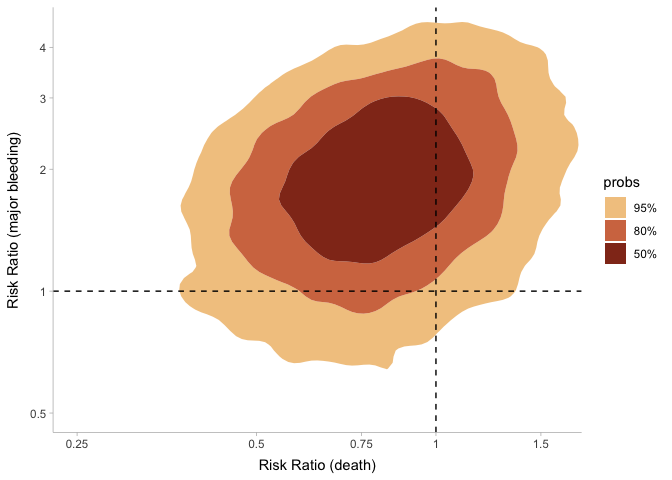

Untitled
================

Load packages and data

``` r
# Install/load packages
pacman::p_load(here,
               rio,
               brms,
               tidyr,
               MetBrewer,
               ggdensity,
               cmdstanr,
               bayesmeta,
               tidybayes,
               posterior,
               tidyverse,
               metafor,
               gt)

# Load death data
d1 = import(here("data", "tpa.xlsx")) |> 
  transform(outcome = "death")

# Load bleeding data
d2 = import(here("data", "tpa2.xlsx")) |> 
  transform(outcome = "bleed")

d = rbind(d1, d2)
```

Estimate log risk ratios

``` r
d_logRR = 
  metafor::escalc(
  measure = "RR", # log risk ratio,
  
  # tPA
  ai = r2,
  n1i = n2,
  
  # AC
  ci = r1,
  n2i = n1,
  
  data = d
)
```

Construct a variance-covariance matrix assuming within-study correlation
= $0.5$

``` r
V = metafor::vcalc(vi, cluster=study, type=outcome, rho=0.5, data=d_logRR)
```

Fit a Bayesian bivariate meta-analysis. Further methodological details
in [Burke et
al. 2016](https://journals.sagepub.com/doi/10.1177/0962280216631361).

``` r
# Specify formula
mf = 
  brms::bf(yi ~ 0 + outcome + (0 + outcome|study) + fcor(V))

get_prior(mf, 
          data = d_logRR,
          data2 = list(V = V),
          family = gaussian)
```

    ##                 prior class         coef group resp dpar nlpar lb ub
    ##                (flat)     b                                         
    ##                (flat)     b outcomebleed                            
    ##                (flat)     b outcomedeath                            
    ##                lkj(1)   cor                                         
    ##                lkj(1)   cor              study                      
    ##  student_t(3, 0, 2.5)    sd                                     0   
    ##  student_t(3, 0, 2.5)    sd              study                  0   
    ##  student_t(3, 0, 2.5)    sd outcomebleed study                  0   
    ##  student_t(3, 0, 2.5)    sd outcomedeath study                  0   
    ##  student_t(3, 0, 2.5) sigma                                     0   
    ##        source
    ##       default
    ##  (vectorized)
    ##  (vectorized)
    ##       default
    ##  (vectorized)
    ##       default
    ##  (vectorized)
    ##  (vectorized)
    ##  (vectorized)
    ##       default

Extract informative priors for between-study heterogeneity from [Turner
et al. 2014](https://onlinelibrary.wiley.com/doi/10.1002/sim.6381)

``` r
tau_death = bayesmeta::TurnerEtAlPrior("all-cause mortality",
                                       "pharmacological",
                                       "placebo / control")

bleed_death = bayesmeta::TurnerEtAlPrior("adverse events",
                                         "pharmacological",
                                         "placebo / control")

logmean_death = tau_death$parameters["tau", "mu"] # -1.975 
logsd_death = tau_death$parameters["tau", "sigma"] # 0.67

logmean_bleed = bleed_death$parameters["tau", "mu"] # -0.935 
logsd_bleed = bleed_death$parameters["tau", "sigma"] # 0.76
```

Define priors (weakly informative for treatment effects, informative for
between-study heterogeneities, and weakly informative for the
correlation parameters)

``` r
priors = 
  prior(normal(0, 0.82), class = "b", coef = "outcomedeath") +
  prior(normal(0, 0.82), class = "b", coef = "outcomebleed") +
  prior(lognormal(-1.975, 0.67), class = "sd", coef = "outcomedeath", group = "study") +
  prior(lognormal(-0.935, 0.76), class = "sd", coef = "outcomebleed", group = "study") +
  prior(lkj(2), class = cor) +
  prior(constant(1), class = "sigma")
```

Fit model

``` r
m1 = brms::brm(
  formula = mf,
  prior = priors,
  data = d_logRR,
  data2 = list(V = V),
  family = gaussian,
  
  warmup = 2000, 
  iter = 4000,
  chains = 4,
  cores = parallel::detectCores(),
  seed = 123,
  backend = "cmdstanr",
  
  file = here::here("model", "m1.Rds"),
  file_refit = "on_change"
)
```

``` r
parameters = 
  m1 |> 
  tidy_draws() |> 
  reframe("ATE: Death" = b_outcomedeath,
          "ATE: Major Bleeding" = b_outcomebleed,
            
          "Tau: Death" = sd_study__outcomedeath,
          "Tau: Major Bleeding" = sd_study__outcomebleed,
            
          "Correlation" = cor_study__outcomebleed__outcomedeath) |> 
  pivot_longer(everything()) |> 
  group_by(name) |> 
  median_hdi(value) |> 
  mutate(across(value:.upper, ~round(., 2))) |> 
  select(-c(.width:.interval))

parameters |> 
  filter(str_detect(name, "ATE")) |> 
  mutate(across(-name, ~round(exp(.), 2))) |> 
  reframe(Parameter = name, 
          "Median [95% CrI]" = str_c(value, " [", .lower, ", ", .upper, "]")) |> 
  
  rbind(
    parameters |> 
    filter(str_detect(name, "ATE", negate = T)) |> 
    reframe(Parameter = name, 
            "Median [95% CrI]" = str_c(value, " [", .lower, ", ", .upper, "]"))
  ) |> 
  gt()
```

<div id="oklpoyvtwg" style="padding-left:0px;padding-right:0px;padding-top:10px;padding-bottom:10px;overflow-x:auto;overflow-y:auto;width:auto;height:auto;">
<style>html {
  font-family: -apple-system, BlinkMacSystemFont, 'Segoe UI', Roboto, Oxygen, Ubuntu, Cantarell, 'Helvetica Neue', 'Fira Sans', 'Droid Sans', Arial, sans-serif;
}

#oklpoyvtwg .gt_table {
  display: table;
  border-collapse: collapse;
  margin-left: auto;
  margin-right: auto;
  color: #333333;
  font-size: 16px;
  font-weight: normal;
  font-style: normal;
  background-color: #FFFFFF;
  width: auto;
  border-top-style: solid;
  border-top-width: 2px;
  border-top-color: #A8A8A8;
  border-right-style: none;
  border-right-width: 2px;
  border-right-color: #D3D3D3;
  border-bottom-style: solid;
  border-bottom-width: 2px;
  border-bottom-color: #A8A8A8;
  border-left-style: none;
  border-left-width: 2px;
  border-left-color: #D3D3D3;
}

#oklpoyvtwg .gt_heading {
  background-color: #FFFFFF;
  text-align: center;
  border-bottom-color: #FFFFFF;
  border-left-style: none;
  border-left-width: 1px;
  border-left-color: #D3D3D3;
  border-right-style: none;
  border-right-width: 1px;
  border-right-color: #D3D3D3;
}

#oklpoyvtwg .gt_caption {
  padding-top: 4px;
  padding-bottom: 4px;
}

#oklpoyvtwg .gt_title {
  color: #333333;
  font-size: 125%;
  font-weight: initial;
  padding-top: 4px;
  padding-bottom: 4px;
  padding-left: 5px;
  padding-right: 5px;
  border-bottom-color: #FFFFFF;
  border-bottom-width: 0;
}

#oklpoyvtwg .gt_subtitle {
  color: #333333;
  font-size: 85%;
  font-weight: initial;
  padding-top: 0;
  padding-bottom: 6px;
  padding-left: 5px;
  padding-right: 5px;
  border-top-color: #FFFFFF;
  border-top-width: 0;
}

#oklpoyvtwg .gt_bottom_border {
  border-bottom-style: solid;
  border-bottom-width: 2px;
  border-bottom-color: #D3D3D3;
}

#oklpoyvtwg .gt_col_headings {
  border-top-style: solid;
  border-top-width: 2px;
  border-top-color: #D3D3D3;
  border-bottom-style: solid;
  border-bottom-width: 2px;
  border-bottom-color: #D3D3D3;
  border-left-style: none;
  border-left-width: 1px;
  border-left-color: #D3D3D3;
  border-right-style: none;
  border-right-width: 1px;
  border-right-color: #D3D3D3;
}

#oklpoyvtwg .gt_col_heading {
  color: #333333;
  background-color: #FFFFFF;
  font-size: 100%;
  font-weight: normal;
  text-transform: inherit;
  border-left-style: none;
  border-left-width: 1px;
  border-left-color: #D3D3D3;
  border-right-style: none;
  border-right-width: 1px;
  border-right-color: #D3D3D3;
  vertical-align: bottom;
  padding-top: 5px;
  padding-bottom: 6px;
  padding-left: 5px;
  padding-right: 5px;
  overflow-x: hidden;
}

#oklpoyvtwg .gt_column_spanner_outer {
  color: #333333;
  background-color: #FFFFFF;
  font-size: 100%;
  font-weight: normal;
  text-transform: inherit;
  padding-top: 0;
  padding-bottom: 0;
  padding-left: 4px;
  padding-right: 4px;
}

#oklpoyvtwg .gt_column_spanner_outer:first-child {
  padding-left: 0;
}

#oklpoyvtwg .gt_column_spanner_outer:last-child {
  padding-right: 0;
}

#oklpoyvtwg .gt_column_spanner {
  border-bottom-style: solid;
  border-bottom-width: 2px;
  border-bottom-color: #D3D3D3;
  vertical-align: bottom;
  padding-top: 5px;
  padding-bottom: 5px;
  overflow-x: hidden;
  display: inline-block;
  width: 100%;
}

#oklpoyvtwg .gt_group_heading {
  padding-top: 8px;
  padding-bottom: 8px;
  padding-left: 5px;
  padding-right: 5px;
  color: #333333;
  background-color: #FFFFFF;
  font-size: 100%;
  font-weight: initial;
  text-transform: inherit;
  border-top-style: solid;
  border-top-width: 2px;
  border-top-color: #D3D3D3;
  border-bottom-style: solid;
  border-bottom-width: 2px;
  border-bottom-color: #D3D3D3;
  border-left-style: none;
  border-left-width: 1px;
  border-left-color: #D3D3D3;
  border-right-style: none;
  border-right-width: 1px;
  border-right-color: #D3D3D3;
  vertical-align: middle;
  text-align: left;
}

#oklpoyvtwg .gt_empty_group_heading {
  padding: 0.5px;
  color: #333333;
  background-color: #FFFFFF;
  font-size: 100%;
  font-weight: initial;
  border-top-style: solid;
  border-top-width: 2px;
  border-top-color: #D3D3D3;
  border-bottom-style: solid;
  border-bottom-width: 2px;
  border-bottom-color: #D3D3D3;
  vertical-align: middle;
}

#oklpoyvtwg .gt_from_md > :first-child {
  margin-top: 0;
}

#oklpoyvtwg .gt_from_md > :last-child {
  margin-bottom: 0;
}

#oklpoyvtwg .gt_row {
  padding-top: 8px;
  padding-bottom: 8px;
  padding-left: 5px;
  padding-right: 5px;
  margin: 10px;
  border-top-style: solid;
  border-top-width: 1px;
  border-top-color: #D3D3D3;
  border-left-style: none;
  border-left-width: 1px;
  border-left-color: #D3D3D3;
  border-right-style: none;
  border-right-width: 1px;
  border-right-color: #D3D3D3;
  vertical-align: middle;
  overflow-x: hidden;
}

#oklpoyvtwg .gt_stub {
  color: #333333;
  background-color: #FFFFFF;
  font-size: 100%;
  font-weight: initial;
  text-transform: inherit;
  border-right-style: solid;
  border-right-width: 2px;
  border-right-color: #D3D3D3;
  padding-left: 5px;
  padding-right: 5px;
}

#oklpoyvtwg .gt_stub_row_group {
  color: #333333;
  background-color: #FFFFFF;
  font-size: 100%;
  font-weight: initial;
  text-transform: inherit;
  border-right-style: solid;
  border-right-width: 2px;
  border-right-color: #D3D3D3;
  padding-left: 5px;
  padding-right: 5px;
  vertical-align: top;
}

#oklpoyvtwg .gt_row_group_first td {
  border-top-width: 2px;
}

#oklpoyvtwg .gt_summary_row {
  color: #333333;
  background-color: #FFFFFF;
  text-transform: inherit;
  padding-top: 8px;
  padding-bottom: 8px;
  padding-left: 5px;
  padding-right: 5px;
}

#oklpoyvtwg .gt_first_summary_row {
  border-top-style: solid;
  border-top-color: #D3D3D3;
}

#oklpoyvtwg .gt_first_summary_row.thick {
  border-top-width: 2px;
}

#oklpoyvtwg .gt_last_summary_row {
  padding-top: 8px;
  padding-bottom: 8px;
  padding-left: 5px;
  padding-right: 5px;
  border-bottom-style: solid;
  border-bottom-width: 2px;
  border-bottom-color: #D3D3D3;
}

#oklpoyvtwg .gt_grand_summary_row {
  color: #333333;
  background-color: #FFFFFF;
  text-transform: inherit;
  padding-top: 8px;
  padding-bottom: 8px;
  padding-left: 5px;
  padding-right: 5px;
}

#oklpoyvtwg .gt_first_grand_summary_row {
  padding-top: 8px;
  padding-bottom: 8px;
  padding-left: 5px;
  padding-right: 5px;
  border-top-style: double;
  border-top-width: 6px;
  border-top-color: #D3D3D3;
}

#oklpoyvtwg .gt_striped {
  background-color: rgba(128, 128, 128, 0.05);
}

#oklpoyvtwg .gt_table_body {
  border-top-style: solid;
  border-top-width: 2px;
  border-top-color: #D3D3D3;
  border-bottom-style: solid;
  border-bottom-width: 2px;
  border-bottom-color: #D3D3D3;
}

#oklpoyvtwg .gt_footnotes {
  color: #333333;
  background-color: #FFFFFF;
  border-bottom-style: none;
  border-bottom-width: 2px;
  border-bottom-color: #D3D3D3;
  border-left-style: none;
  border-left-width: 2px;
  border-left-color: #D3D3D3;
  border-right-style: none;
  border-right-width: 2px;
  border-right-color: #D3D3D3;
}

#oklpoyvtwg .gt_footnote {
  margin: 0px;
  font-size: 90%;
  padding-left: 4px;
  padding-right: 4px;
  padding-left: 5px;
  padding-right: 5px;
}

#oklpoyvtwg .gt_sourcenotes {
  color: #333333;
  background-color: #FFFFFF;
  border-bottom-style: none;
  border-bottom-width: 2px;
  border-bottom-color: #D3D3D3;
  border-left-style: none;
  border-left-width: 2px;
  border-left-color: #D3D3D3;
  border-right-style: none;
  border-right-width: 2px;
  border-right-color: #D3D3D3;
}

#oklpoyvtwg .gt_sourcenote {
  font-size: 90%;
  padding-top: 4px;
  padding-bottom: 4px;
  padding-left: 5px;
  padding-right: 5px;
}

#oklpoyvtwg .gt_left {
  text-align: left;
}

#oklpoyvtwg .gt_center {
  text-align: center;
}

#oklpoyvtwg .gt_right {
  text-align: right;
  font-variant-numeric: tabular-nums;
}

#oklpoyvtwg .gt_font_normal {
  font-weight: normal;
}

#oklpoyvtwg .gt_font_bold {
  font-weight: bold;
}

#oklpoyvtwg .gt_font_italic {
  font-style: italic;
}

#oklpoyvtwg .gt_super {
  font-size: 65%;
}

#oklpoyvtwg .gt_footnote_marks {
  font-style: italic;
  font-weight: normal;
  font-size: 75%;
  vertical-align: 0.4em;
}

#oklpoyvtwg .gt_asterisk {
  font-size: 100%;
  vertical-align: 0;
}

#oklpoyvtwg .gt_indent_1 {
  text-indent: 5px;
}

#oklpoyvtwg .gt_indent_2 {
  text-indent: 10px;
}

#oklpoyvtwg .gt_indent_3 {
  text-indent: 15px;
}

#oklpoyvtwg .gt_indent_4 {
  text-indent: 20px;
}

#oklpoyvtwg .gt_indent_5 {
  text-indent: 25px;
}
</style>
<table class="gt_table">
  
  <thead class="gt_col_headings">
    <tr>
      <th class="gt_col_heading gt_columns_bottom_border gt_left" rowspan="1" colspan="1" scope="col" id="Parameter">Parameter</th>
      <th class="gt_col_heading gt_columns_bottom_border gt_left" rowspan="1" colspan="1" scope="col" id="Median [95% CrI]">Median [95% CrI]</th>
    </tr>
  </thead>
  <tbody class="gt_table_body">
    <tr><td headers="Parameter" class="gt_row gt_left">ATE: Death</td>
<td headers="Median [95% CrI]" class="gt_row gt_left">0.79 [0.44, 1.43]</td></tr>
    <tr><td headers="Parameter" class="gt_row gt_left">ATE: Major Bleeding</td>
<td headers="Median [95% CrI]" class="gt_row gt_left">1.84 [0.84, 3.82]</td></tr>
    <tr><td headers="Parameter" class="gt_row gt_left">Correlation</td>
<td headers="Median [95% CrI]" class="gt_row gt_left">-0.16 [-0.89, 0.69]</td></tr>
    <tr><td headers="Parameter" class="gt_row gt_left">Tau: Death</td>
<td headers="Median [95% CrI]" class="gt_row gt_left">0.14 [0.02, 0.43]</td></tr>
    <tr><td headers="Parameter" class="gt_row gt_left">Tau: Major Bleeding</td>
<td headers="Median [95% CrI]" class="gt_row gt_left">0.68 [0.15, 1.38]</td></tr>
  </tbody>
  
  
</table>
</div>

ATE = average treatment effect (linear scale) Tau = Between-study
variance (log scale)

Let’s visualize the bivariate distribution of both ATEs.

``` r
m1 |> 
  tidybayes::tidy_draws() |> 
  ggplot() +
  aes(x = b_outcomedeath, b_outcomebleed) +
  ggdensity::geom_hdr(
    probs = c(0.95, 0.8, 0.5),
    aes(fill = after_stat(probs)), 
    alpha = 1
  ) +
  scale_fill_manual(values = met.brewer("OKeeffe2", 3)) +
  geom_hline(yintercept = 0, linetype = 2) +
  geom_vline(xintercept = 0, linetype = 2) +
  scale_x_continuous(breaks = log(c(0.25, 0.75, seq(0.5, 1.5, 0.5))),
                     labels = c(0.25, 0.75, seq(0.5, 1.5, 0.5))) +
  
  scale_y_continuous(breaks = log(c(0.5, seq(1, 4, 1))),
                     labels = c(0.5, seq(1, 4, 1))) +
  coord_cartesian(x = log(c(0.25, 1.6)),
                  y = log(c(0.5, 4.5))) +
  labs(x = "Risk Ratio (death)",
       y = "Risk Ratio (major bleeding)") +
  ggdist::theme_ggdist()
```

<!-- -->

Bivariate analyses allow one to ask conditional probabilities, such as:

What is the posterior probability that…

- RR_death \< 1.0 AND RR_bleeding \< 1.0? (q1)

- RR_death \< 1.0 AND RR_bleeding \> 1.0? (q2)

- RR_death \< 1.0 AND RR_bleeding \> 2.0? (q3)

- RR_death \> 1.0 AND RR_bleeding \> 1.0? (q4)

``` r
m1 |> 
  tidybayes::tidy_draws() |> 
  reframe(q1 = mean(b_outcomedeath < log(1) & b_outcomebleed < log(1)),
          q2 = mean(b_outcomedeath < log(1) & b_outcomebleed > log(1)),
          q3 = mean(b_outcomedeath < log(1) & b_outcomebleed > log(2)),
          q4 = mean(b_outcomedeath > log(1) & b_outcomebleed > log(1))) |> 
  gt()
```

<div id="fwsanlygku" style="padding-left:0px;padding-right:0px;padding-top:10px;padding-bottom:10px;overflow-x:auto;overflow-y:auto;width:auto;height:auto;">
<style>html {
  font-family: -apple-system, BlinkMacSystemFont, 'Segoe UI', Roboto, Oxygen, Ubuntu, Cantarell, 'Helvetica Neue', 'Fira Sans', 'Droid Sans', Arial, sans-serif;
}

#fwsanlygku .gt_table {
  display: table;
  border-collapse: collapse;
  margin-left: auto;
  margin-right: auto;
  color: #333333;
  font-size: 16px;
  font-weight: normal;
  font-style: normal;
  background-color: #FFFFFF;
  width: auto;
  border-top-style: solid;
  border-top-width: 2px;
  border-top-color: #A8A8A8;
  border-right-style: none;
  border-right-width: 2px;
  border-right-color: #D3D3D3;
  border-bottom-style: solid;
  border-bottom-width: 2px;
  border-bottom-color: #A8A8A8;
  border-left-style: none;
  border-left-width: 2px;
  border-left-color: #D3D3D3;
}

#fwsanlygku .gt_heading {
  background-color: #FFFFFF;
  text-align: center;
  border-bottom-color: #FFFFFF;
  border-left-style: none;
  border-left-width: 1px;
  border-left-color: #D3D3D3;
  border-right-style: none;
  border-right-width: 1px;
  border-right-color: #D3D3D3;
}

#fwsanlygku .gt_caption {
  padding-top: 4px;
  padding-bottom: 4px;
}

#fwsanlygku .gt_title {
  color: #333333;
  font-size: 125%;
  font-weight: initial;
  padding-top: 4px;
  padding-bottom: 4px;
  padding-left: 5px;
  padding-right: 5px;
  border-bottom-color: #FFFFFF;
  border-bottom-width: 0;
}

#fwsanlygku .gt_subtitle {
  color: #333333;
  font-size: 85%;
  font-weight: initial;
  padding-top: 0;
  padding-bottom: 6px;
  padding-left: 5px;
  padding-right: 5px;
  border-top-color: #FFFFFF;
  border-top-width: 0;
}

#fwsanlygku .gt_bottom_border {
  border-bottom-style: solid;
  border-bottom-width: 2px;
  border-bottom-color: #D3D3D3;
}

#fwsanlygku .gt_col_headings {
  border-top-style: solid;
  border-top-width: 2px;
  border-top-color: #D3D3D3;
  border-bottom-style: solid;
  border-bottom-width: 2px;
  border-bottom-color: #D3D3D3;
  border-left-style: none;
  border-left-width: 1px;
  border-left-color: #D3D3D3;
  border-right-style: none;
  border-right-width: 1px;
  border-right-color: #D3D3D3;
}

#fwsanlygku .gt_col_heading {
  color: #333333;
  background-color: #FFFFFF;
  font-size: 100%;
  font-weight: normal;
  text-transform: inherit;
  border-left-style: none;
  border-left-width: 1px;
  border-left-color: #D3D3D3;
  border-right-style: none;
  border-right-width: 1px;
  border-right-color: #D3D3D3;
  vertical-align: bottom;
  padding-top: 5px;
  padding-bottom: 6px;
  padding-left: 5px;
  padding-right: 5px;
  overflow-x: hidden;
}

#fwsanlygku .gt_column_spanner_outer {
  color: #333333;
  background-color: #FFFFFF;
  font-size: 100%;
  font-weight: normal;
  text-transform: inherit;
  padding-top: 0;
  padding-bottom: 0;
  padding-left: 4px;
  padding-right: 4px;
}

#fwsanlygku .gt_column_spanner_outer:first-child {
  padding-left: 0;
}

#fwsanlygku .gt_column_spanner_outer:last-child {
  padding-right: 0;
}

#fwsanlygku .gt_column_spanner {
  border-bottom-style: solid;
  border-bottom-width: 2px;
  border-bottom-color: #D3D3D3;
  vertical-align: bottom;
  padding-top: 5px;
  padding-bottom: 5px;
  overflow-x: hidden;
  display: inline-block;
  width: 100%;
}

#fwsanlygku .gt_group_heading {
  padding-top: 8px;
  padding-bottom: 8px;
  padding-left: 5px;
  padding-right: 5px;
  color: #333333;
  background-color: #FFFFFF;
  font-size: 100%;
  font-weight: initial;
  text-transform: inherit;
  border-top-style: solid;
  border-top-width: 2px;
  border-top-color: #D3D3D3;
  border-bottom-style: solid;
  border-bottom-width: 2px;
  border-bottom-color: #D3D3D3;
  border-left-style: none;
  border-left-width: 1px;
  border-left-color: #D3D3D3;
  border-right-style: none;
  border-right-width: 1px;
  border-right-color: #D3D3D3;
  vertical-align: middle;
  text-align: left;
}

#fwsanlygku .gt_empty_group_heading {
  padding: 0.5px;
  color: #333333;
  background-color: #FFFFFF;
  font-size: 100%;
  font-weight: initial;
  border-top-style: solid;
  border-top-width: 2px;
  border-top-color: #D3D3D3;
  border-bottom-style: solid;
  border-bottom-width: 2px;
  border-bottom-color: #D3D3D3;
  vertical-align: middle;
}

#fwsanlygku .gt_from_md > :first-child {
  margin-top: 0;
}

#fwsanlygku .gt_from_md > :last-child {
  margin-bottom: 0;
}

#fwsanlygku .gt_row {
  padding-top: 8px;
  padding-bottom: 8px;
  padding-left: 5px;
  padding-right: 5px;
  margin: 10px;
  border-top-style: solid;
  border-top-width: 1px;
  border-top-color: #D3D3D3;
  border-left-style: none;
  border-left-width: 1px;
  border-left-color: #D3D3D3;
  border-right-style: none;
  border-right-width: 1px;
  border-right-color: #D3D3D3;
  vertical-align: middle;
  overflow-x: hidden;
}

#fwsanlygku .gt_stub {
  color: #333333;
  background-color: #FFFFFF;
  font-size: 100%;
  font-weight: initial;
  text-transform: inherit;
  border-right-style: solid;
  border-right-width: 2px;
  border-right-color: #D3D3D3;
  padding-left: 5px;
  padding-right: 5px;
}

#fwsanlygku .gt_stub_row_group {
  color: #333333;
  background-color: #FFFFFF;
  font-size: 100%;
  font-weight: initial;
  text-transform: inherit;
  border-right-style: solid;
  border-right-width: 2px;
  border-right-color: #D3D3D3;
  padding-left: 5px;
  padding-right: 5px;
  vertical-align: top;
}

#fwsanlygku .gt_row_group_first td {
  border-top-width: 2px;
}

#fwsanlygku .gt_summary_row {
  color: #333333;
  background-color: #FFFFFF;
  text-transform: inherit;
  padding-top: 8px;
  padding-bottom: 8px;
  padding-left: 5px;
  padding-right: 5px;
}

#fwsanlygku .gt_first_summary_row {
  border-top-style: solid;
  border-top-color: #D3D3D3;
}

#fwsanlygku .gt_first_summary_row.thick {
  border-top-width: 2px;
}

#fwsanlygku .gt_last_summary_row {
  padding-top: 8px;
  padding-bottom: 8px;
  padding-left: 5px;
  padding-right: 5px;
  border-bottom-style: solid;
  border-bottom-width: 2px;
  border-bottom-color: #D3D3D3;
}

#fwsanlygku .gt_grand_summary_row {
  color: #333333;
  background-color: #FFFFFF;
  text-transform: inherit;
  padding-top: 8px;
  padding-bottom: 8px;
  padding-left: 5px;
  padding-right: 5px;
}

#fwsanlygku .gt_first_grand_summary_row {
  padding-top: 8px;
  padding-bottom: 8px;
  padding-left: 5px;
  padding-right: 5px;
  border-top-style: double;
  border-top-width: 6px;
  border-top-color: #D3D3D3;
}

#fwsanlygku .gt_striped {
  background-color: rgba(128, 128, 128, 0.05);
}

#fwsanlygku .gt_table_body {
  border-top-style: solid;
  border-top-width: 2px;
  border-top-color: #D3D3D3;
  border-bottom-style: solid;
  border-bottom-width: 2px;
  border-bottom-color: #D3D3D3;
}

#fwsanlygku .gt_footnotes {
  color: #333333;
  background-color: #FFFFFF;
  border-bottom-style: none;
  border-bottom-width: 2px;
  border-bottom-color: #D3D3D3;
  border-left-style: none;
  border-left-width: 2px;
  border-left-color: #D3D3D3;
  border-right-style: none;
  border-right-width: 2px;
  border-right-color: #D3D3D3;
}

#fwsanlygku .gt_footnote {
  margin: 0px;
  font-size: 90%;
  padding-left: 4px;
  padding-right: 4px;
  padding-left: 5px;
  padding-right: 5px;
}

#fwsanlygku .gt_sourcenotes {
  color: #333333;
  background-color: #FFFFFF;
  border-bottom-style: none;
  border-bottom-width: 2px;
  border-bottom-color: #D3D3D3;
  border-left-style: none;
  border-left-width: 2px;
  border-left-color: #D3D3D3;
  border-right-style: none;
  border-right-width: 2px;
  border-right-color: #D3D3D3;
}

#fwsanlygku .gt_sourcenote {
  font-size: 90%;
  padding-top: 4px;
  padding-bottom: 4px;
  padding-left: 5px;
  padding-right: 5px;
}

#fwsanlygku .gt_left {
  text-align: left;
}

#fwsanlygku .gt_center {
  text-align: center;
}

#fwsanlygku .gt_right {
  text-align: right;
  font-variant-numeric: tabular-nums;
}

#fwsanlygku .gt_font_normal {
  font-weight: normal;
}

#fwsanlygku .gt_font_bold {
  font-weight: bold;
}

#fwsanlygku .gt_font_italic {
  font-style: italic;
}

#fwsanlygku .gt_super {
  font-size: 65%;
}

#fwsanlygku .gt_footnote_marks {
  font-style: italic;
  font-weight: normal;
  font-size: 75%;
  vertical-align: 0.4em;
}

#fwsanlygku .gt_asterisk {
  font-size: 100%;
  vertical-align: 0;
}

#fwsanlygku .gt_indent_1 {
  text-indent: 5px;
}

#fwsanlygku .gt_indent_2 {
  text-indent: 10px;
}

#fwsanlygku .gt_indent_3 {
  text-indent: 15px;
}

#fwsanlygku .gt_indent_4 {
  text-indent: 20px;
}

#fwsanlygku .gt_indent_5 {
  text-indent: 25px;
}
</style>
<table class="gt_table">
  
  <thead class="gt_col_headings">
    <tr>
      <th class="gt_col_heading gt_columns_bottom_border gt_right" rowspan="1" colspan="1" scope="col" id="q1">q1</th>
      <th class="gt_col_heading gt_columns_bottom_border gt_right" rowspan="1" colspan="1" scope="col" id="q2">q2</th>
      <th class="gt_col_heading gt_columns_bottom_border gt_right" rowspan="1" colspan="1" scope="col" id="q3">q3</th>
      <th class="gt_col_heading gt_columns_bottom_border gt_right" rowspan="1" colspan="1" scope="col" id="q4">q4</th>
    </tr>
  </thead>
  <tbody class="gt_table_body">
    <tr><td headers="q1" class="gt_row gt_right">0.062625</td>
<td headers="q2" class="gt_row gt_right">0.7155</td>
<td headers="q3" class="gt_row gt_right">0.289375</td>
<td headers="q4" class="gt_row gt_right">0.2145</td></tr>
  </tbody>
  
  
</table>
</div>
